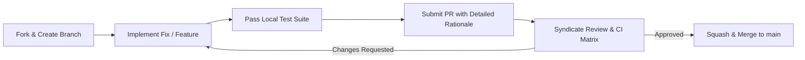

# 🛠️ Contributing to marko1olo/avito-dental-ai-bot

> **Engineering Guidelines, Architecture Invariants & Pull Request Lifecycle**  
> Maintained by the **Жирняк & Адольф Петушков** Engineering Syndicate

Thank you for your interest in contributing to **marko1olo/avito-dental-ai-bot**. This project operates under strict technical standards: deep mathematical and domain correctness, zero-slop code, explicit typing, and zero unverified assumptions.

---

## 🏛️ 1. Core Engineering Invariants

Before proposing any changes, verify that your implementation satisfies our domain invariants:

1. **4-Stage Veto Pipeline**:  Every lead message must pass Intent Detection -> Symptom Check -> Price Estimation -> Doctor Veto.
2. **Deterministic Clinic Pricing**:  Price estimates must come from authenticated SQL price tables, never hallucinated by LLMs.
3. **CRM Lead Deduplication**:  Patient telephone numbers must be normalized to E.164 format and deduplicated before insertion.
4. **Audit Logging**:  Every automated message sent to a marketplace lead must be recorded in the immutable interaction log.

---

## 💻 2. Local Development & Toolchain

### 2.1 Prerequisites
* **Tech Stack**: `Python 3.11 / asyncio / pydantic / Fastify Bridge / PostgreSQL`
* Ensure your compiler / runtime matches the repository configuration exactly.

### 2.2 Setup Workflow
```bash
# Clone the repository
git clone https://github.com/marko1olo/avito-dental-ai-bot.git
cd avito-dental-ai-bot

# Install dependencies / configure build
npm install # or make / dotnet restore depending on project

# Run the test suite
pytest tests/ -v && ruff check .
```

---

## 📐 3. Coding Standards & Style

1. **Zero AI-Slop & Filler**:
   * Do NOT add generic, conversational comments (e.g. `// This function handles...`, `// This is useful because...`).
   * Code must be self-explanatory through precise naming, mathematical clarity, and strong types.
   * Only document non-obvious mathematical invariants, hardware quirks, or algorithmic complexity bounds.

2. **Strong Typing & Strict Validation**:
   * Zero `any`, `unknown` bypasses, or untyped data flows.
   * All external inputs, network payloads, and deserialized states must pass strict schema validation at the system boundary.

3. **Performance & Memory Hygiene**:
   * Render and simulation loops must produce zero heap allocations per frame.
   * Reuse pre-allocated buffers, typed arrays, or object pools.
   * Guarantee deterministic cleanup of native resources, file handles, and event listeners.

---

## 🧪 4. Testing & Verification Requirements

Every pull request must be accompanied by empirical proof of correctness:
1. **Unit Tests**: Add targeted tests covering both the nominal path and boundary edge cases.
2. **Regression Verification**: Ensure all existing test suites pass cleanly with `pytest tests/ -v && ruff check .`.
3. **No Mocks in Core Solvers**: Domain logic must be tested against real mathematical and architectural invariants, not mock interfaces.

---

## 🚀 5. Pull Request & Review Protocol



1. **Branch Naming**: Use descriptive prefixes: `fix/<issue-name>`, `feat/<feature-name>`, `perf/<optimization>`.
2. **Commit Messages**: Follow Conventional Commits format: `fix(subsystem): brief summary of change`.
3. **PR Description**: Include:
   * Root cause analysis of the bug or architectural rationale for the feature.
   * Exact commands used to verify correctness and raw test output snippets.
   * Confirmation that no unrelated files or stylistic diffs were introduced.

---

### 👥 Engineering Syndicate
Maintained by **Жирняк** & **Адольф Петушков**.
