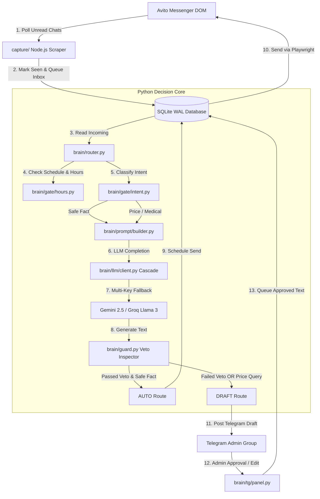

<div align="center">

# 🦷 Avito Dental & Medical AI Assistant

### *Production-Grade Hybrid AI Messenger Assistant with Zero-Hallucination Veto System & Telegram Admin Panel*

[](LICENSE.md)
[](https://python.org)
[](https://nodejs.org)
[](https://playwright.dev)
[](brain/tests)
[](brain/store)

[Features](#-key-features) • [Architecture](#-architecture) • [Security & Privacy](#-security--152-fl-compliance) • [Quick Start](#-quick-start) • [Configuration](#-configuration-guide) • [Tests](#-testing) • [Deployment](#-production-deployment)

</div>

---

> [!IMPORTANT]
> **Zero-Hallucination Guarantee**: In medical and dental sales, a hallucinated price or guaranteed outcome damages trust and creates legal liabilities. This system uses a **Deterministic Veto Layer** that inspects AI outputs before they reach the patient, enforcing strict price caps, medical disclaimers, and human oversight.

---

## ⚡ Overview

**Avito Dental AI Assistant** is an autonomous hybrid response system engineered for dental clinics and medical services operating on the **Avito** platform.

Standard AI chatbots fail in medical settings because LLMs tend to invent complex pricing ("Root canal treatment for 12,500 ₽") or provide medical diagnoses. This project solves that problem through a **Hybrid Dual-Pass Architecture**:

1. **Safe Facts (Auto Mode)**: Harmless queries (clinic address, parking, office hours, free initial consultation) receive instant natural responses with human-like typing delays (40–90 seconds).
2. **Medical & Pricing Queries (Draft Mode)**: Inquiries regarding symptoms, caries, implants, or orthodontics generate an interactive **Telegram Draft** for admin approval with a single click.

---

## ✨ Key Features

| Feature | Description | Benefit |
| :--- | :--- | :--- |
| **🛡️ Deterministic Price Veto** | Regular expression & whitelist validator (`brain/guard.py`) inspects LLM responses. | **0% Hallucination**: Unapproved numbers drop to Telegram drafts. |
| **🔄 Multi-LLM Cascade & Rotation** | Automatic rotation across 17+ API keys (Gemini 2.5 Flash, Llama 3.3 70B, Llama 3.1 8B). | **100% Uptime**: Seamless fallback on 429 quota limits or 5xx server errors. |
| **💬 Interactive Telegram Panel** | Push notifications with inline buttons: `[Send]`, `[Edit]`, `[Ignore]`, `[Takeover]`, `[Pause AI]`. | **1-Click Control**: Admins can approve or rewrite responses in seconds. |
| **🔒 152-FL PII Compliance** | Patient phone numbers are hashed (`phone_hash`) before DB storage; raw numbers scrubbed from logs. | **Zero Data Leakage**: Protects sensitive medical communications. |
| **⏳ Human Jitter & Typing Simulation** | Calculates response delay based on character count (250 chars/min) + Gaussian jitter. | **Authentic Interaction**: Patients never feel like they are talking to a bot. |
| **⚡ Dual Transport Architecture** | Node.js Playwright DOM crawler + Python Decision Core sharing an isolated SQLite WAL database. | **High Reliability**: Browser scraper crashes never lose dialogue state. |

---

## 📊 Comparison Matrix

| Metric / Feature | Generic LLM Chatbot | Raw Avito Bot | **Avito Dental AI Assistant** |
| :--- | :---: | :---: | :---: |
| **Price Accuracy** | ⚠️ High Risk (Hallucinates) | ❌ Static Text | ✅ **100% Verified (Veto Controlled)** |
| **Medical Compliance** | ❌ May give medical advice | ❌ None | ✅ **Strict Medical Disclaimers** |
| **Admin Control** | ❌ No intervention | ❌ Hardcoded | ✅ **Telegram Panel with Rewriting** |
| **PII Scrubbing** | ❌ Stores raw chats | ❌ Stores raw chats | ✅ **152-FL Hashed Storage** |
| **API Resilience** | ❌ Single API Key | ❌ Single Endpoint | ✅ **17 Key Cascade + Auto Fallback** |

---

## 📐 Architecture & Data Flow



---

## 🔒 Security & 152-FL Compliance

Medical interactions contain sensitive personal information (PII). This system enforces privacy by design:

1. **No Raw Phone Numbers in Database**: Patient phones are converted to a 16-character SHA-256 hash (`phone_hash`) with salt.
2. **Log Scrubbing (`brain/pii.py`)**: All application logs automatically redact phone numbers (`[телефон]`) and email addresses (`[email]`).
3. **Whitelist Protection**: Clinic's official phone numbers are whitelisted so CTAs like *"Call us at +7 (800) 555-35-35"* are never scrubbed.
4. **Isolated Memory**: Browser session cookies (`.profile/`) and environment keys (`.env`) are excluded via `.gitignore`.

---

## 🛠️ Installation & Setup

### Prerequisites
- **Node.js**: `v20.0.0` or higher
- **Python**: `v3.11` or higher

### 1. Clone Repository

```bash
git clone https://github.com/marko1olo/avito-dental-ai-bot.git
cd avito-dental-ai-bot
```

### 2. Install Node.js Transport Dependencies

```bash
cd capture
npm install --omit=optional
cd ..
```

> [!TIP]
> On Node 22.5+ or Node 24, the transport automatically utilizes native built-in `node:sqlite`, requiring **zero native C++ compilation**.

### 3. Install Python Dependencies

```bash
pip install httpx python-dotenv
```

### 4. Configure Environment Variables (`.env`)

Copy `.env.example` to `.env`:

```bash
cp .env.example .env
```

Fill in your configuration:

```env
# Multiple LLM API keys (Comma-separated)
GOOGLE_API_KEYS=AIzaSyKey1,AIzaSyKey2
GROQ_API_KEYS=gsk_Key1,gsk_Key2

# Telegram Admin Bot & Chat ID
TELEGRAM_BOT_TOKEN=123456789:ABCdefGHIjklMNOpqrsTUVwxyZ
TELEGRAM_CHAT_ID=-100123456789

# Browser Session Paths
AVITO_PROFILE=C:\bots\avito-reply\.profile
AVITO_BOT_DB=C:\bots\avito-reply\state.db
AVITO_BOT_STATE_DIR=C:\bots\avito-reply\state

# Operating Mode: hybrid | draft
AVITO_BOT_MODE=hybrid
```

---

## ⚙️ Configuration Guide

The system uses a single source of truth for facts and pricing located in `data/`:

* **`data/clinic-facts.json`**: Controls clinic identity, address, office hours, metro stations, and allowed/prohibited services.
* **`data/patient-quotes.json`**: Machine-readable catalog of visit-level quotes. Set `"quote_allowed": true` for prices the bot can state directly.
* **`data/ortho-prices.json`**: Internal price ranges and clinic procurement costs (kept strictly off-prompt).

### Sample `clinic-facts.json` Structure:

```json
{
  "identity": {
    "status": "confirmed",
    "legal_name": "ООО «Стоматология-Плюс»",
    "brand": "Стоматология «ДентаКлиника»",
    "address": "г. Москва, ул. Центральная, 10",
    "metro": ["Центральная", "Маяковская"],
    "timezone": "Europe/Moscow"
  },
  "hours": {
    "weekdays": {"opens": "09:00", "last_appointment": "18:00"}
  }
}
```

---

## 🧪 Testing

The repository ships with **425 automated unit tests** covering intent classification, hours calculation, veto verification, LLM key rotation, Telegram button parsing, and SQLite WAL thread safety:

```bash
python -X utf8 brain/tests/test_gate.py       # Intent & Hours logic
python -X utf8 brain/tests/test_guard.py      # Price & Medical Veto
python -X utf8 brain/tests/test_facts.py      # Logistics & Whitelists
python -X utf8 brain/tests/test_followup.py   # Inactivity Followups
python -X utf8 brain/tests/test_store.py      # SQLite WAL & 152-FL Hash
python -X utf8 brain/tests/test_client.py     # LLM Cascade & 429 Rotation
python -X utf8 brain/tests/test_panel.py      # Telegram Admin Interface
```

**All 425 tests run locally without external network calls or active API keys.**

---

## 🖥️ Production Deployment

### Running the Python Decision Daemon

```bash
python brain/run.py
```

### Running the Node.js Avito Transport

```bash
cd capture
npm run poll
```

### Avito Initial Authentication

To log into your clinic's Avito account interactively and establish persistent session cookies:

```bash
cd capture
npm run login
```

---

## 📄 License

This project is open-source software licensed under the **[MIT License](LICENSE.md)**.

Developed for high-conversion medical lead management. Contributions and PRs welcome!
