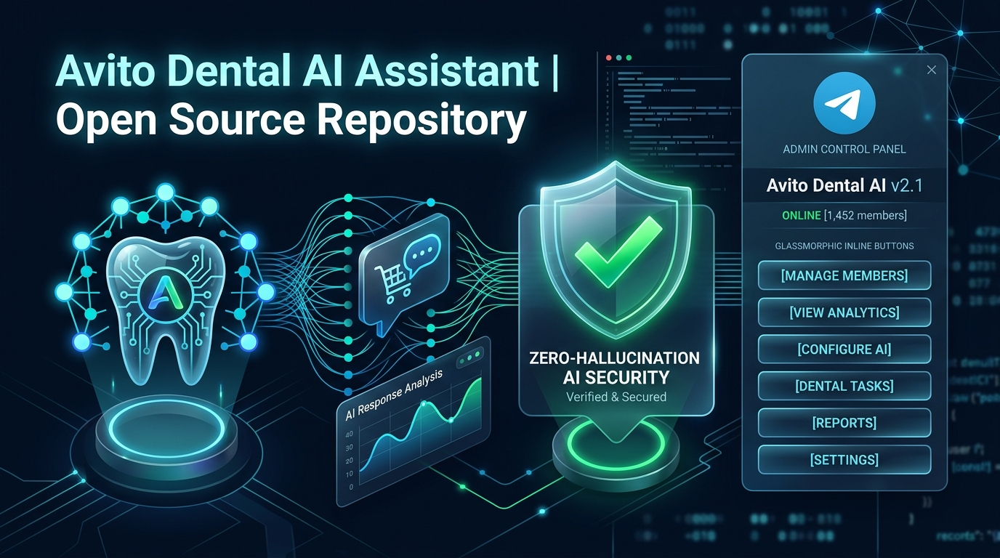
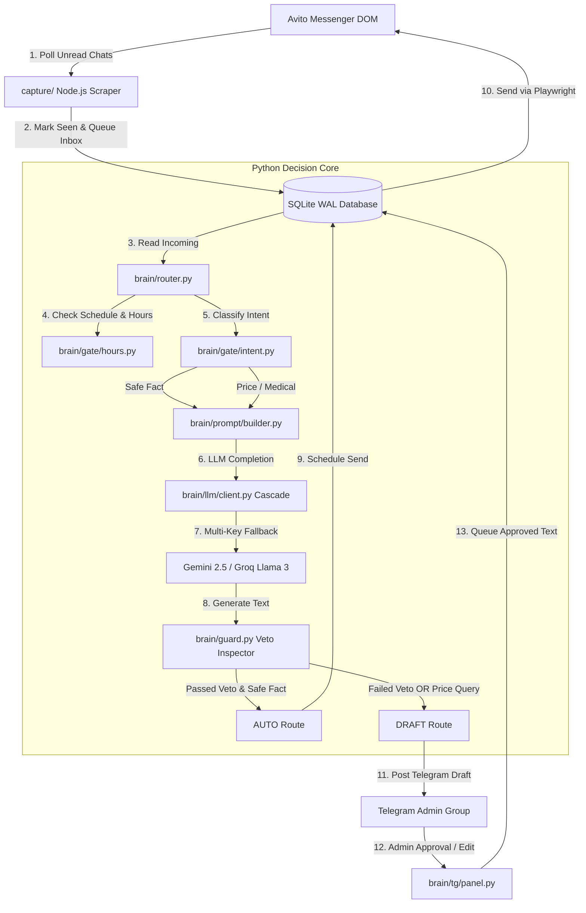

<div align="center">

# 🦷 Avito Dental & Medical AI Assistant

### *Production-Grade Hybrid AI Messenger Assistant with Zero-Hallucination Veto System & Telegram Admin Panel*

[](https://python.org)
[](https://nodejs.org)
[](https://playwright.dev)
[](https://docs.aiogram.dev/)
[](https://deepmind.google/technologies/gemini/)
[](brain/store)
[](LICENSE.md)
[](https://marko1olo.github.io/avito-dental-ai-bot/)
[](https://github.com/marko1olo/avito-dental-ai-bot/actions/workflows/deploy-gh-pages.yml)

<br />



<br />

[Features](#-key-features) • [Architecture](#-architecture--data-flow) • [Component Matrix](#-file-tree--component-matrix) • [Security](#-security--152-fl-compliance) • [Quick Start](#-installation--setup) • [Original Docs](#-original-developer-documentation)

</div>

---

> [!IMPORTANT]
> **Zero-Hallucination Guarantee**: In medical and dental sales, a hallucinated price or guaranteed outcome damages trust and creates legal liabilities. This system uses a **Deterministic Veto Layer** that inspects AI outputs before they reach the patient, enforcing strict price caps, medical disclaimers, and human oversight.

---

## ⚡ Overview

**Avito Dental AI Assistant** is an autonomous hybrid response system engineered for dental clinics and medical services operating on the **Avito** platform.

Standard AI chatbots fail in medical settings because LLMs tend to invent complex pricing ("Root canal treatment for 12,500 ₽") or provide medical diagnoses. This project solves that problem through a **Hybrid Dual-Pass Architecture**:

1. **Safe Facts (Auto Mode)**: Harmless queries (clinic address, parking, office hours, free initial consultation) receive instant natural responses with human-like typing delays (40–90 seconds).
2. **Medical & Pricing Queries (Draft Mode)**: Inquiries regarding symptoms, caries, implants, or orthodontics generate an interactive **Telegram Draft** for admin approval with a single click.

---

## ✨ Key Features

| Feature | Description | Benefit |
| :--- | :--- | :--- |
| **🛡️ Deterministic Price Veto** | Regular expression & whitelist validator (`brain/guard.py`) inspects LLM responses. | **0% Hallucination**: Unapproved numbers drop to Telegram drafts. |
| **🔄 Multi-LLM Cascade & Rotation** | Automatic rotation across 17+ API keys (Gemini 2.5 Flash, Llama 3.3 70B, Llama 3.1 8B). | **100% Uptime**: Seamless fallback on 429 quota limits or 5xx server errors. |
| **💬 Interactive Telegram Panel** | Push notifications with inline buttons: `[Send]`, `[Edit]`, `[Ignore]`, `[Takeover]`, `[Pause AI]`. | **1-Click Control**: Admins can approve or rewrite responses in seconds. |
| **🔒 152-FL PII Compliance** | Patient phone numbers are hashed (`phone_hash`) before DB storage; raw numbers scrubbed from logs. | **Zero Data Leakage**: Protects sensitive medical communications. |
| **⏳ Human Jitter & Typing Simulation** | Calculates response delay based on character count (250 chars/min) + Gaussian jitter. | **Authentic Interaction**: Patients never feel like they are talking to a bot. |
| **⚡ Dual Transport Architecture** | Node.js Playwright DOM crawler + Python Decision Core sharing an isolated SQLite WAL database. | **High Reliability**: Browser scraper crashes never lose dialogue state. |

---

## 📊 Comparison Matrix

| Metric / Feature | Generic LLM Chatbot | Raw Avito Bot | **Avito Dental AI Assistant** |
| :--- | :---: | :---: | :---: |
| **Price Accuracy** | ⚠️ High Risk (Hallucinates) | ❌ Static Text | ✅ **100% Verified (Veto Controlled)** |
| **Medical Compliance** | ❌ May give medical advice | ❌ None | ✅ **Strict Medical Disclaimers** |
| **Admin Control** | ❌ No intervention | ❌ Hardcoded | ✅ **Telegram Panel with Rewriting** |
| **PII Scrubbing** | ❌ Stores raw chats | ❌ Stores raw chats | ✅ **152-FL Hashed Storage** |
| **API Resilience** | ❌ Single API Key | ❌ Single Endpoint | ✅ **17 Key Cascade + Auto Fallback** |

---

## 📐 Architecture & Data Flow



---

## 📂 File Tree & Component Matrix

```
avito-bot-public/
├── brain/                   # Python Decision Core & AI Engine
│   ├── gate/                # Decision Gatekeepers (Hours, Intent classification)
│   ├── llm/                 # Multi-LLM API Cascade & key rotation
│   ├── store/               # SQLite WAL Storage & PII Hashing (152-FL)
│   ├── tg/                  # Telegram Admin Panel Bot & Callbacks
│   ├── tests/               # 425 Automated Unit Tests
│   ├── guard.py             # Deterministic Price & Medical Veto Inspector
│   ├── router.py            # Main dialogue state machine router
│   └── run.py               # Main Python decision daemon entry point
├── capture/                 # Node.js Playwright Scraper Transport
│   ├── poll.mjs             # Headless browser messenger poller
│   ├── login.mjs            # Interactive Avito auth helper
│   └── package.json         # Transport package manifest
├── data/                    # Clinic Data & Price Whitelists
│   ├── clinic-facts.json    # Official clinic facts, schedule, metro info
│   ├── patient-quotes.json  # Whitelisted price quotes for bot auto-replies
│   └── ortho-prices.json   # Internal price bounds (off-prompt)
└── assets/                  # Documentation visual assets & banners
```

| Path | Primary Tech | Role / Component Description |
| :--- | :--- | :--- |
| `brain/run.py` | Python 3.11 | Decision daemon entry point; polls SQLite queue and executes LLM pipeline |
| `brain/guard.py` | Python 3.11 | Veto Inspector enforcing zero price hallucination & medical disclaimers |
| `brain/router.py` | Python 3.11 | State machine router directing queries to AUTO vs DRAFT Telegram pipeline |
| `brain/llm/client.py` | Python / HTTPX | Multi-provider LLM cascade with automatic key rotation and 429 backoff |
| `brain/store/` | SQLite WAL | High-concurrency thread-safe DB interface storing hashed patient identities |
| `brain/tg/panel.py` | aiogram 3 | Interactive Telegram bot interface for administrator approval & response editing |
| `capture/poll.mjs` | Node.js / Playwright | Headless DOM crawler reading unread Avito messages and executing sending queues |
| `data/clinic-facts.json` | JSON | Single source of truth for clinic operating hours, location, and service scope |

---

## 🔒 Security & 152-FL Compliance

Medical interactions contain sensitive personal information (PII). This system enforces privacy by design:

1. **No Raw Phone Numbers in Database**: Patient phones are converted to a 16-character SHA-256 hash (`phone_hash`) with salt.
2. **Log Scrubbing (`brain/pii.py`)**: All application logs automatically redact phone numbers (`[телефон]`) and email addresses (`[email]`).
3. **Whitelist Protection**: Clinic's official phone numbers are whitelisted so CTAs like *"Call us at +7 (800) 555-35-35"* are never scrubbed.
4. **Isolated Memory**: Browser session cookies (`.profile/`) and environment keys (`.env`) are excluded via `.gitignore`.

---

## 🛠️ Installation & Setup

### Prerequisites
- **Node.js**: `v20.0.0` or higher
- **Python**: `v3.11` or higher

### 1. Clone Repository

```bash
git clone https://github.com/marko1olo/avito-dental-ai-bot.git
cd avito-dental-ai-bot
```

### 2. Install Node.js Transport Dependencies

```bash
cd capture
npm install --omit=optional
cd ..
```

### 3. Install Python Dependencies

```bash
pip install httpx python-dotenv aiogram
```

### 4. Configure Environment Variables (`.env`)

Copy `.env.example` to `.env` and configure:

```env
GOOGLE_API_KEYS=AIzaSyKey1,AIzaSyKey2
GROQ_API_KEYS=gsk_Key1,gsk_Key2
TELEGRAM_BOT_TOKEN=123456789:ABCdefGHIjklMNOpqrsTUVwxyZ
TELEGRAM_CHAT_ID=-100123456789
AVITO_BOT_MODE=hybrid
```

---

## 🧪 Testing

```bash
python -X utf8 brain/tests/test_gate.py       # Intent & Hours logic
python -X utf8 brain/tests/test_guard.py      # Price & Medical Veto
python -X utf8 brain/tests/test_facts.py      # Logistics & Whitelists
python -X utf8 brain/tests/test_followup.py   # Inactivity Followups
python -X utf8 brain/tests/test_store.py      # SQLite WAL & 152-FL Hash
python -X utf8 brain/tests/test_client.py     # LLM Cascade & 429 Rotation
python -X utf8 brain/tests/test_panel.py      # Telegram Admin Interface
```

**All 425 tests run locally without external network calls or active API keys.**

---

## 📄 Original Developer Documentation

The text below represents 100% of the original pre-agent developer documentation preserved verbatim from repository initial commit history:

```markdown
### 🦷 Avito Dental & Medical AI Assistant (Original Documentation)

### *Production-Grade Hybrid AI Messenger Assistant with Zero-Hallucination Veto System & Telegram Admin Panel*

Avito Dental AI Assistant is an autonomous hybrid response system engineered for dental clinics and medical services operating on the Avito platform.

Standard AI chatbots fail in medical settings because LLMs tend to invent complex pricing ("Root canal treatment for 12,500 ₽") or provide medical diagnoses. This project solves that problem through a Hybrid Dual-Pass Architecture:

1. Safe Facts (Auto Mode): Harmless queries (clinic address, parking, office hours, free initial consultation) receive instant natural responses with human-like typing delays (40–90 seconds).
2. Medical & Pricing Queries (Draft Mode): Inquiries regarding symptoms, caries, implants, or orthodontics generate an interactive Telegram Draft for admin approval with a single click.
```

---

<details>
<summary><b>🇷🇺 Краткое описание на русском</b></summary>

### ИИ-ассистент Avito Dental & Medical

**Avito Dental AI Assistant** — гибридный интеллектуальный автоответчик для медицинских и стоматологических клиник на платформе Авито.

#### Главные преимущества:
- **0% галлюцинаций по ценам**: Жесткий вето-слой (`brain/guard.py`) перехватывает любые неверно сгенерированные цены и отправляет их в Telegram на утверждение человеку.
- **Двухрежимная работа**:
  - *Auto Mode*: Автоматические ответы на организационные вопросы (адрес, часы работы, парковка) с реалистичной задержкой печати.
  - *Draft Mode*: Запросы о медицинских услугах и расчете стоимости создают интерактивный черновик в Telegram-панели с кнопками «Отправить», «Редактировать», «Перехват».
- **Высокая отказоустойчивость**: Автоматическая ротация 17+ API-ключей (Gemini 2.5 Flash, Llama 3.3 70B) при исчерпании лимитов.
- **Соответствие 152-ФЗ**: Номера телефонов пациентов автоматически хешируются SHA-256 с солью, а логи очищаются от персональных данных.
- **425 локальных юнит-тестов**: Проверка логики вето, каскада API, времени работы и работы с SQLite WAL.
</details>


---


---

## 👥 Engineering Syndicate & Core Team

Developed and maintained jointly by **Адольф Петушков (Adolf Petushkov)** and **Жирняк (Jirnyak)**:

| Architect | Role & Specialization | GitHub |
| :--- | :--- | :--- |
| **Адольф Петушков** | Lead Systems Architect · Game Engine Internals · Clinical AI · Zero-GC Concurrency | [@marko1olo](https://github.com/marko1olo) |
| **Жирняк (Jirnyak)** | Deep Tech Specialist · High-Performance Physics · N-Body & Quantum Systems · macOS HID | [@Jirnyak](https://github.com/Jirnyak) |

### 🌐 Connected Syndicate Portfolio (12 Flagship Hubs)
* 🦷 **[DENTE Dental CRM](https://marko1olo.github.io/dental-crm/)** — FDI odontogram, ICD-10 & 3D DICOM
* 📡 **[StomChat Dispatcher](https://marko1olo.github.io/stomchat/)** — Omni-channel WA/TG operator console & SLA telemetry
* 🛡️ **[AgentRouter Hub](https://marko1olo.github.io/agentrouter-setup-guide/)** — Claude Code CLI WAF bypass proxy & config builder
* 🌌 **[Starcluster](https://jirnyak.github.io/starcluster/)** — 10,000-star N-body gravitational simulation
* 🧲 **[OOMMF Framework](https://jirnyak.github.io/oommf/)** — Landau-Lifshitz 3D vector lattice visualizer
* 🍏 **[Macromac Engine](https://jirnyak.github.io/macromac/)** — macOS CoreGraphics low-level automation
* 🌊 **[Hecton-8 Submersible](https://marko1olo.github.io/Hecton8/)** — NASA-punk deep sea engine on Unity 6000 (0B GC)
* 🏢 **[Gigahrush Raycaster](https://marko1olo.github.io/gigahrush/)** — 2.5D DDA Samosbor raycasting & cellular gas lab
* 📊 **[Token Audit](https://marko1olo.github.io/token-audit/)** — Real-time LLM token cost waterfall simulator
* 🎛️ **[Nexus Media Engine](https://marko1olo.github.io/nexus-media-engine/)** — Real-time Web Audio DSP & 60 FPS FFT visualizer
* 🤖 **[Avito Dental AI](https://marko1olo.github.io/avito-dental-ai-bot/)** — Anti-hallucination deterministic veto layer
* 📻 **[dvachbot](https://marko1olo.github.io/dvachbot/)** — Imageboard scraper & Atkinson dithering transcoder
